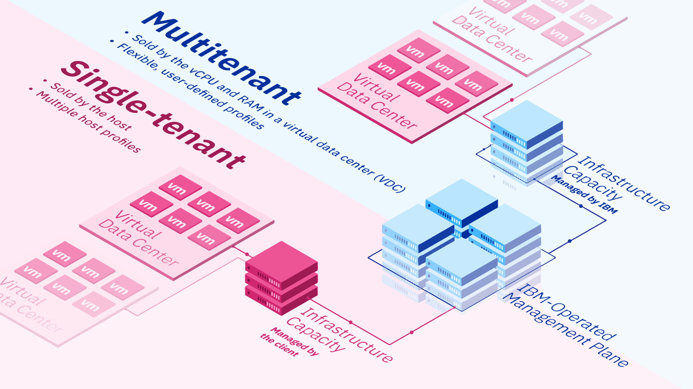

---

copyright:
  years: 2022, 2025

lastupdated: "2025-10-24"

subcollection: vmware-service

keywords: public isolation for vmware service, compute isolation for vmware service, vmware service architecture, workload isolation in vmware service

---

{{site.data.keyword.attribute-definition-list}}

# Learning about {{site.data.keyword.vcf-aas}} architecture and workload isolation
{: #architecture-workload-isolation-learning}

{{site.data.content.vms-deprecated-note}}

The {{site.data.keyword.vmware-service_full}} architecture is based on the following logical entities that are created per supported cloud region.

* Management domain - Hosts the {{site.data.keyword.IBM_notm}} operations tools and all the single-tenant customer management tools except for the networking edges that are used by customer workloads.
* Customer workload domain - Hosts single-tenant and multitenant {{site.data.keyword.cloud_notm}} IaaS, networking edges, and customer-deployed networking and workloads.

{: caption="{{site.data.keyword.vcf-aas}} region" caption-side="bottom"}

The architecture details the {{site.data.keyword.vcf-aas-full}} solution components and different architecture layers to provide an isolated and private implementation for customers. The architecture provides customizable deployment choices of infrastructure and VMware Cloud Director™ based virtual data center environments.

With single-tenant and multitenant Cloud Director instances and its virtual data center instances, customers can migrate or deploy VMware® by Broadcom workloads to the cloud on the IBM-hosted and managed VMware by Broadcom infrastructure. Customer workloads that consist of networking configurations and VMs are separated to isolated and virtualized infrastructure.

## {{site.data.keyword.vcf-aas}} management domain architecture
{: #architecture-workload-isolation-mgmt}

The management domain contains the components for managing the virtual infrastructure of the workload domains in {{site.data.keyword.vcf-aas}}. The management domain also provides the foundation for deploying solutions for workload provisioning and operations management.

The management domain consists of tools to support the virtual infrastructure, cloud operations, cloud automation, business continuity, and security and compliance components for {{site.data.keyword.vcf-aas}}. {{site.data.keyword.vcf-aas}} allocates separate workload domains per customer instance for the single-tenant service and uses Cloud Director organizational isolation for multitenant customers within a single workload domain. Each workload domain is managed by a separate vCenter Server instance and a dedicated NSX-T™ Manager cluster for scalability. The vCenter Server and VMware NSX-T Manager components for these workload domains run in the management domain.

The management domain runs all management components in the {{site.data.keyword.vcf-aas}} offering for both the management domain and workload domains, except for workload NSX-T Edge nodes. {{site.data.keyword.vcf-aas}} starts with an initial management domain configuration that is extended with each workload domain deployment.

## {{site.data.keyword.vcf-aas}} workload domain architecture
{: #architecture-workload-isolation-wkld}

A workload domain represents a logical unit that groups VMware ESXi™ hosts managed by vCenter Server, NSX-T, and VMware Cloud Director that are dedicated to a workload domain instance. Workload domains exist in the boundaries of an {{site.data.keyword.cloud_notm}} region.

The following types of workload domains exist:

* Single-tenant workload domain, which is fully dedicated to a single {{site.data.keyword.cloud_notm}} customer account. The infrastructure and management components are both fully dedicated.
* Multitenant workload domain, which consists of infrastructure and management components that are used by many customers. Each customers VMware by Broadcom environment is fully isolated through Cloud Director organizations.

Each workload domain contains the following components that are installed in the management domain:

* NSX-T segment to isolate the management components
* One VMware vCenter Server® instance
* One NSX-T data center instance
* One VMware Cloud Director instance

Offloading customer workload instance management components into the management domain makes IaaS resources available in the workload domain for running customer workloads.

The following components are installed in the workload domain:

* At least one VMware vSphere® cluster with vSphere HA with single-tenant ESXi bare metal servers, networking and shared storage
* Optionally, one NSX-T Edge cluster that connects the workloads in the domain for logical switching, logical dynamic routing, and load balancing

The customer workload domain is reserved for use by customer workloads except for NSX-T Edge clusters used for North-South networking traffic.

## {{site.data.keyword.vcf-aas}} workload isolation and data protection
{: #architecture-workload-isolation-trust-zones}

{{site.data.keyword.vcf-aas}} uses trust zones. Trust zones are a logical grouping of components that are known, controlled, and trusted. Protection boundaries are established between trust zones as described in the following table.

| Name | Description | Boundary |
|:---- |:----------- |:-------- |
| Management plane | {{site.data.keyword.vcf-aas}} operational management components | Management plane resources exist in {{site.data.keyword.cloud_notm}} classic IaaS regions. Operational interfaces used to access the management domain are protected by networking appliance firewalls and the use of bastion hosts by the operations team. Management component connectivity to the workload plane takes place through networking appliances. Public connectivity to all customer public service interfaces is protected through Akamai security. Customers access VMware Cloud Director and associated service portals by using the web UI through the Akamai security layer from the public network. These interfaces are restricted and do not enable customers to transit further through the management plane network. |
| Workload plane | VMware Cloud Director Virtual Data Centers consisting of vApps, virtual machines (VM), and virtual networks | Operations management interfaces into the workload plane are protected by networking appliance firewalls and bastion hosts. Customer workloads are allowed by VMware Cloud Director to attach only to restricted, separate NSX-T virtualized networks that are running as overlays on the classic IaaS network. Therefore, customer VMs do not have broad access to the Workload Plane management and storage networks. Customer network access is restricted by NSX-T edge appliances. Customer workload connectivity to the public takes place through NSX-T edge routers that are managed by the customer through a restricted VMware Cloud Director interface. Customer workload connectivity to private takes place through IBM-managed NSX-T edge routers that are configured to limit connectivity to well-known {{site.data.keyword.cloud_notm}} private services. |
{: caption="Description and boundaries for the management and workload planes" caption-side="bottom"}

### Data protection
{: #architecture-workload-isolation-data-protection}

Client metadata is associated with the {{site.data.keyword.vcf-aas}} instances that the client creates. When the instance is deleted by the client, the metadata is maintained in the database where the instance state is set to `Deleted`. Client metadata is maintained in the database unless the client requests the data to be removed through an IBM Support ticket.

Client metadata is stored in {{site.data.keyword.cloud_notm}} databases (ICD) that encrypts all data both in transit and at rest.

The credentials that are used to access the underlay IaaS and VMware by Broadcom components are also stored in the database. They are stored with a second layer of envelope encryption in addition to the DB encryption by using [{{site.data.keyword.cloud_notm}} Key Protect](https://cloud.ibm.com/catalog/services/key-protect){: external} Root Key with wrapped Data Encryption Key (DEK). The unwrapped DEK is to encrypt and decrypt the final data.

Envelope encryption uses a unique Key Protect instance per region with unique root key and DEK per microservice in the {{site.data.keyword.vcf-aas}} solution across all customer instances.

### Data and data protection for client-owned data
{: #architecture-workload-isolation-data-client}

Client-owned data is hosted only in the workload domain instance data plane on customer-isolated data stores.

Data at rest is stored either on network attached storage or on dedicated disks that are associated with managed bare metal servers. IBM provides storage policies for these data stores that offer vSphere encryption and customers can choose to apply these policies to their workloads so that VMs are protected by vSphere encryption.

The use of vSphere encryption is not enforced by IBM because it is not desirable in every instance. Unique scenarios exist for each customer deployment and it's a customer selectable option to enable disk encryption for workloads.

VMs encrypted by vSphere encryption are protected by an IBM-owned Key Protect instance with unique Key Protect instance, unique root key, and unique data encryption key per workload domain instance. Additionally, customer backups are stored in separate storage that is protected by Veeam® encryption, which generates keys automatically for each tenant or backup job.

Several possible instances of customer data in motion exist. Customer network data flows over NSX-T virtualized overlay network segments and is isolated to the customer. NSX-T virtualized overlay networking does not provide intrinsic encryption, for data confidentiality, you must use a network encryption technique such as IPsec, SSL, or SSH. Customer disk traffic in flight is protected if customers use vSphere encryption. Customer vMotion traffic in flight is protected by vMotion encryption.

Client-owned data includes the following items:

* VMs
* Backups
* Data-in-motion on the {{site.data.keyword.cloud_notm}} networks and SDN networks
* Customer configurations used in the solution, such as connections to on-premises and user authentication in the solution

In all cases, data must be resilient to support solution continuity and recovery if a disaster occurs.

## Related links
{: #architecture-workload-isolation-links}

* [Securing your data in {{site.data.keyword.vcf-aas}}](/docs/vmware-service?topic=vmware-service-vmaas-data-security)
