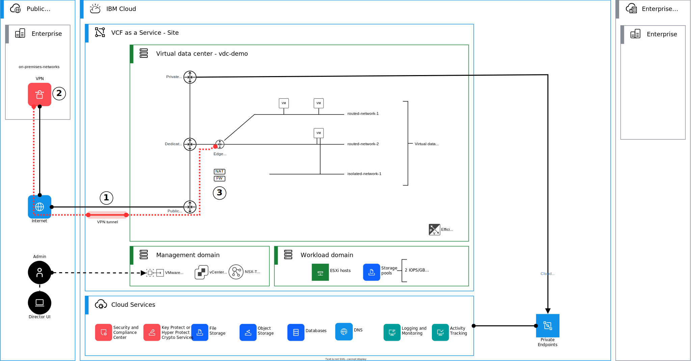
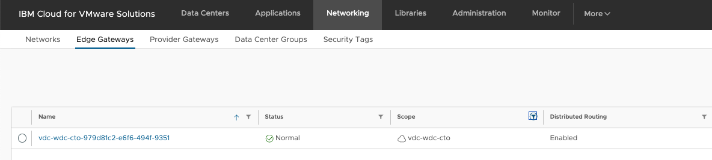
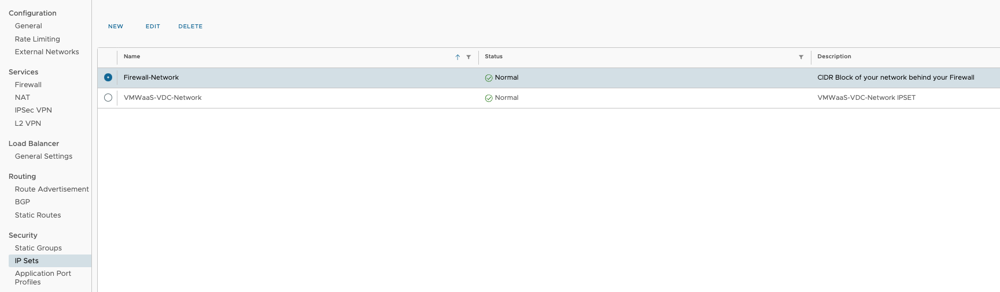
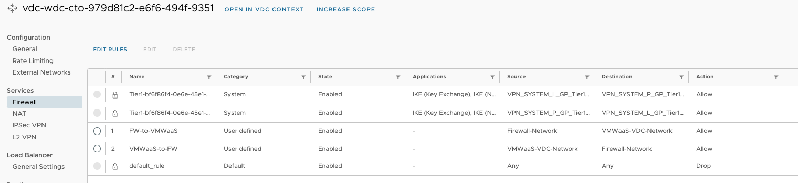
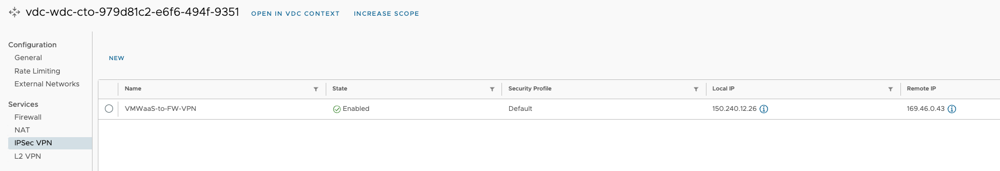
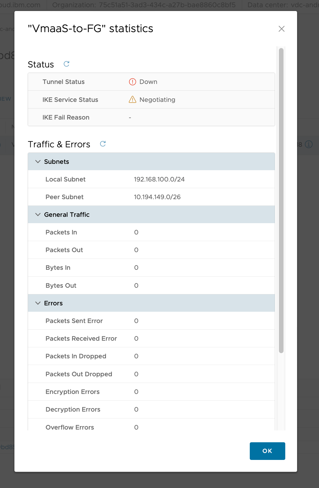
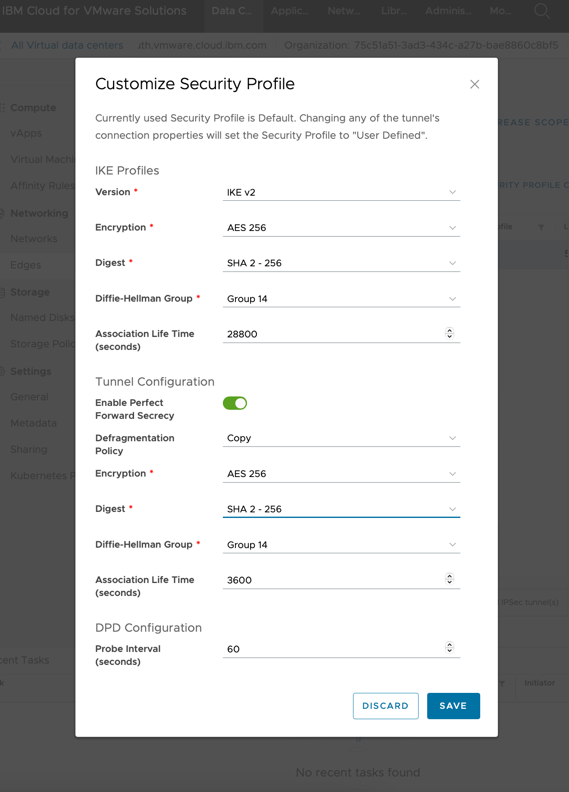
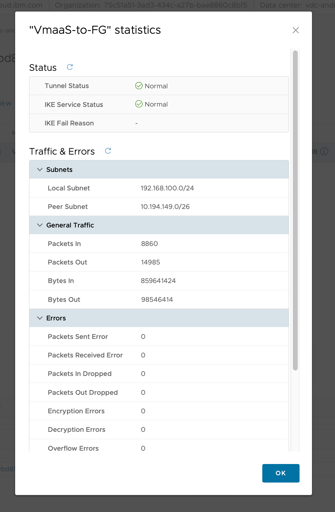

{:step: data-tutorial-type='step'}
{:java: #java .ph data-hd-programlang='java'}
{:swift: #swift .ph data-hd-programlang='swift'}
{:ios: #ios data-hd-operatingsystem="ios"}
{:android: #android data-hd-operatingsystem="android"}
{:shortdesc: .shortdesc}
{:new_window: target="_blank"}
{:codeblock: .codeblock}
{:screen: .screen}
{:tip: .tip}
{:pre: .pre}
{:important: .important}
{:note: .note}

# Creating a VPN between the virtual data center edge gateway and the on-premises VPN gateway
{: #vmwaas-ipsec-tunnel}
{: toc-content-type="tutorial"}
{: toc-services="vmware-service"}
{: toc-completion-time="1h"}


This tutorial might incur costs. Use the [Cost estimator](https://cloud.ibm.com/estimator/){: external} to generate a cost estimate based on your projected usage.
{: tip}


## Objectives
{: #vmwaas-ipsec-tunnel-objectives}

The objective of this tutorial is to demonstrate the basic steps of connecting an {{site.data.keyword.vmware-service_full}} single-tenant or multitenant instance with Juniper® vSRX. The connection happens through a Virtual Private Network (VPN). vSRX can either be deployed in the {{site.data.keyword.cloud_notm}} Classic Infrastructure or in a client data center. The following steps create a basic working environment, providing a VPN, a basic firewall implementation, and end-to-end network connectivity.

In this tutorial, you will learn:

* How to create VPNs between a virtual data center (VDC) edge gateway and vSRX.
* How to create and configure matching IKE and IPsec tunnel proposals and profiles.
* How to configure firewall rules on your VDC edge gateway and vSRX to allow VPN traffic.

The following diagram presents an overview of the solution to be deployed.

{: caption="Architecture diagram of the tutorial" caption-side="bottom"}
{: style="text-align: center;"}

## Before you begin
{: #vmwaas-ipsec-tunnel-prereqs}

This tutorial requires:

* An {{site.data.keyword.cloud_notm}} [billable account](/docs/account?topic=account-accounts).
* Required user permissions. Ensure that your user account has sufficient permissions [to create and manage {{site.data.keyword.vcf-aas-full}} resources](/docs/vmware-service?topic=vmware-service-getting-started).
* [A preprovisioned {{site.data.keyword.vcf-aas}} instance](/docs/vmwaresolutions?topic=vmwaresolutions-tenant-ordering).
* [A preprovisioned VDC on {{site.data.keyword.vcf-aas}}](/docs/vmwaresolutions?topic=vmwaresolutions-vdc-adding).
* [{{site.data.keyword.cloud_notm}} CLI](/docs/cli?topic=cli-getting-started).
* An [{{site.data.keyword.cloud_notm}} API key](/docs/account?topic=account-userapikey&interface=ui).

## Gather information and requirements
{: #vmwaas-ipsec-tunnel-gather-requirements}
{: step}

To establish a policy-based tunnel, you need to collect various information from your deployment and design, such as gateway endpoints and local and remote networks. In addition, you need to define the tunnel security policies for IKE and IPsec.

Carefully collect and document the information that is listed and mentioned here. The values must match exactly on tunnel configurations on both sides.
{: important}

Use {{site.data.keyword.cloud_notm}} portal and vSRX firewall configuration to collect the following information and then define IPsec and IKE policy parameters for the tunnel based on your security requirements:

1. Collect local and remote network information for the policy-based tunnel.

   The private interface of the vSRX is typically configured as follows:

   ```bash
   set interfaces reth2 unit <vlan-id> description "Your private network routed through Gateway Appliance"
   set interfaces reth2 unit <vlan-id> vlan-id <vlan-id>
   set interfaces reth2 unit <vlan-id> family inet address <private-IP address-of-the-vsrx>/26
   ```

   You might have multiple secondary IP addresses on the vSRX interface, so collect all the required network information for the tunnel.

   Collect all required VDC network information for the tunnel. Use the VMware Cloud Director™ console or collect the information from your network design documentation (which networks are deployed on the VDC).

   Example values are provided as follows:

   | Prefix               | Value |
   |:-------------------- |:--------------------------- |
   | Subnets behind vSRX  | `10.95.1.0/26` |
   | Subnets on the VDC   | `192.168.100.0/24` |
   {: caption="List of site prefixes or subnets to review before configuring the VPN." caption-side="bottom"}

   As your solution might differ, use the subnets from your network design and deployment.

2. Collect local and remote gateway IP address information for the IPsec tunnel.

   The public interface IP address of vSRX is typically configured as follows in {{site.data.keyword.cloud_notm}}:

   ```bash
   set interfaces reth1 unit 0 description "SL PUBLIC VLAN INTERFACE"
   set interfaces reth1 unit 0 family inet address <public-IP address-of-the-vsrx>/29
   ```

   Collect the Public IP address of the VDC Edge Gateway from your VDC. The public IP addresses are available in the {{site.data.keyword.cloud_notm}} portal, under your VDC instance.

   The following table shows the values that are used in this example:

   | Gateway IP address                 | Value |
   |:---------------------------------- |:--------------------------- |
   | Public IP address of edge gateway  | `<public-IP address-of-the-vdc-edge-gateway>` |
   | Public IP address of vSRX          | `<public-IP address-of-the-vsrx>` |
   {: caption="List of gateway IP addresses to review before configuring the VPN." caption-side="bottom"}

   As your solution might differ, use the endpoint IP addresses matching your deployment.

3. Create a pre-shared key. Generate a pre-shared key `your-psk` for the IPsec tunnel. The key is used in the firewall and VDC IPsec configuration.

4. Define your IKE policy for the tunnel. The following table shows the values that are used in this example:

   | IKE policy                       | Value |
   |:-------------------------------- |:------------------ |
   | Version                          | IKE v2 |
   | Encryption                       | AES 256 |
   | Digest                           | SHA 2 - 256 |
   | Diffie-Hellman Group             | Group 14 |
   | Association Life Time (seconds)  | 28800 |
   {: caption="List of IKE policy parameters to review before configuring the VPN." caption-side="bottom"}

   As your requirements might differ, use the values from your deployment.

5. Define your IPsec (or tunnel) policy for the tunnel. The following table shows the values that are used in this example:

   | IPsec (or tunnel) policy         | Value |
   |:-------------------------------- |:------------------ |
   | Perfect Forward Secrecy          | Enabled |
   | Defragmentation Policy           | Copy |
   | Encryption                       | AES 256 |
   | Digest                           | SHA 2 - 256 |
   | Diffie-Hellman Group             | Group 14 |
   | Association Life Time (seconds)  | 3600 |
   {: caption="List of IPsec (or tunnel) policy parameters to review before configuring the VPN." caption-side="bottom"}

   As your requirements might differ, use the values from your deployment.

6. Define your dead peer detection (DPD) policy for the tunnel. The following table shows the values that are used in this example:

   | DPD                             | Value |
   |:------------------------------- |:------------------ |
   | Probe Interval (seconds)        | 60 |
   {: caption="List of dead peer detection (DPD) policy parameters to review before configuring the VPN." caption-side="bottom"}

   As your requirements might differ, use the values from your deployment.

## Configure vSRX
{: #vmwaas-ipsec-tunnel-config-vsrx}
{: step}

The following configurations use the example policy values that were presented earlier. Your environment and policies might differ, so adjust the configuration commands.

1. Configure the IKE proposal, IKE policy, and pre-shared key:

   ```bash
   set security ike proposal ike-phase1-vmwaas authentication-method pre-shared-keys
   set security ike proposal ike-phase1-vmwaas dh-group group14
   set security ike proposal ike-phase1-vmwaas authentication-algorithm sha-256
   set security ike proposal ike-phase1-vmwaas encryption-algorithm aes-256-cbc
   set security ike proposal ike-phase1-vmwaas lifetime-seconds 28800

   set security ike policy ike-phase1-policy mode main
   set security ike policy ike-phase1-policy proposals ike-phase1-vmwaas
   set security ike policy ike-phase1-policy pre-shared-key ascii-text <your-psk>
   ```

2. Configure the IKE gateway:

   ```bash
   set security ike gateway vmwaas ike-policy ike-phase1-policy
   set security ike gateway vmwaas address <public-IP address-of-the-vdc-edge-gateway>

   set security ike gateway vmwaas external-interface reth1.0
   set security ike gateway vmwaas version v2-only
   ```

3. Configure the IPsec policy and proposal:

   ```bash
   set security ipsec proposal ipsec-phase2-vmwaas protocol esp
   set security ipsec proposal ipsec-phase2-vmwaas authentication-algorithm hmac-sha-256-128
   set security ipsec proposal ipsec-phase2-vmwaas encryption-algorithm aes-256-cbc
   set security ipsec proposal ipsec-phase2-vmwaas lifetime-seconds 3600

   set security ipsec policy ipsec-phase2-policy perfect-forward-secrecy keys group14
   set security ipsec policy ipsec-phase2-policy proposals ipsec-phase2-vmwaas
   ```

4. Configure the IPsec VPN:

   ```bash
   set interfaces st0 unit 0 family inet
   set security ipsec vpn vmwaas-vpn-1 bind-interface st0.0
   set security ipsec vpn vmwaas-vpn-1 ike gateway vmwaas
   set security ipsec vpn vmwaas-vpn-1 ike ipsec-policy ipsec-phase2-policy
   set security ipsec vpn vmwaas-vpn-1 traffic-selector pair1 local-ip 10.95.1.0/26
   set security ipsec vpn vmwaas-vpn-1 traffic-selector pair1 remote-ip 192.168.100.0/24
   set security ipsec vpn vmwaas-vpn-1 establish-tunnels immediately
   set security ipsec vpn vmwaas-vpn-1 df-bit copy
   ```

5. Configure the control plane firewall:

   ```bash
   set firewall filter PROTECT-IN term PING from destination-address 10.95.1.1/32
   set firewall filter PROTECT-IN term PING from protocol icmp

   set firewall filter PROTECT-IN term IPSec-IKE from destination-address `<public-IP address-of-the-vsrx>/32`
   # Alternative way to use source-address
   # set firewall filter PROTECT-IN term IPSec-IKE from source-address `<public-IP address-of-the-vdc-edge-gateway>/32`
   set firewall filter PROTECT-IN term IPSec-IKE from protocol udp
   set firewall filter PROTECT-IN term IPSec-IKE from port 500
   set firewall filter PROTECT-IN term IPSec-IKE then accept

   set firewall filter PROTECT-IN term IPSec-ESP from destination-address `<public-IP address-of-the-vsrx>/32`
   # Alternative way to use source-address
   # set firewall filter PROTECT-IN term IPSec-ESP from source-address `<public-IP address-of-the-vdc-edge-gateway>/32`
   set firewall filter PROTECT-IN term IPSec-ESP from protocol esp
   set firewall filter PROTECT-IN term IPSec-ESP then accept

   set firewall filter PROTECT-IN term IPSec-4500 from destination-address `<public-IP address-of-the-vsrx>/32`
   # Alternative way to use source-address
   # set firewall filter PROTECT-IN term IPSec-4500 from source-address `<public-IP address-of-the-vdc-edge-gateway>/32`
   set firewall filter PROTECT-IN term IPSec-4500 from protocol udp
   set firewall filter PROTECT-IN term IPSec-4500 from port 4500
   set firewall filter PROTECT-IN term IPSec-4500 then accept
   ```

6. Configure the security zones and zone policies:

   ```bash
   set security zones security-zone vpn-vmwaas-tunnel interfaces st0.0
   set security zones security-zone vsrx-vlan interfaces reth2.2498

   set security policies from-zone vsrx-vlan to-zone vpn-vmwaas-tunnel policy vlan_to_vmwaas match source-address any
   set security policies from-zone vsrx-vlan to-zone vpn-vmwaas-tunnel policy vlan_to_vmwaas match destination-address any
   set security policies from-zone vsrx-vlan to-zone vpn-vmwaas-tunnel policy vlan_to_vmwaas match application any
   set security policies from-zone vsrx-vlan to-zone vpn-vmwaas-tunnel policy vlan_to_vmwaas then permit

   set security policies from-zone vpn-vmwaas-tunnel to-zone vsrx-vlan policy vmwaas_to_vlan match source-address any
   set security policies from-zone vpn-vmwaas-tunnel to-zone vsrx-vlan policy vmwaas_to_vlan match destination-address any
   set security policies from-zone vpn-vmwaas-tunnel to-zone vsrx-vlan policy vmwaas_to_vlan match application any
   set security policies from-zone vpn-vmwaas-tunnel to-zone vsrx-vlan policy vmwaas_to_vlan then permit
   ```

7. Configure TCP maximum segment size (MSS):

   ```bash
   set security flow tcp-mss ipsec-vpn mss 1360
   ```

## Configure {{site.data.keyword.vcf-aas}} instance edge gateway
{: #vmwaas-ipsec-tunnel-config-edge-gateway}
{: step}

Log in to your {{site.data.keyword.vcf-aas}} instance, configure networking subnets, firewall rules, and IPsec tunnel.

### Log in to the {{site.data.keyword.vcf-aas}} console
{: #vmwaas-ipsec-tunnel-console}

1. Log in to the {{site.data.keyword.vcf-aas}} instance with a user that has the `Organization Administrator` role.
2. Click **Networking** from the left navigation panel.
3. Under **Edge Gateways**, select the `name` of your Edge Gateway.

   {: caption="{{site.data.keyword.vcf-aas}} VDC Edge Gateway Selection" caption-side="bottom"}
   {: style="text-align: center;"}

4. In the side menu, click **IP Sets** and click **New** to create a new IP Set.
5. Create two IP sets.

   | IP set      | Name               | IP address |
   |:----------- |:------------------ |:------------- |
   | IPSET 1     | Firewall-Network   | `10.95.1.0/26` |
   | IPSET 2     | VMWaaS-VDC-Network | `192.168.100.0/24` |
   {: caption="IP sets details" caption-side="bottom"}

   {: caption="{{site.data.keyword.vcf-aas}} VDC IP sets" caption-side="bottom"}
   {: style="text-align: center;"}

6. Click **Save**.

### Create the VDC gateway firewall rule
{: #vmwaas-ipsec-tunnel-firewall}

The {{site.data.keyword.vcf-aas}} tenant instance is provisioned with a default firewall rule that drops all traffic to ensure security.

You must add two extra rules to allow traffic to and from the VPN connection.

1. With the Edge Gateway selected, click **Firewall** from the left navigation panel.
2. Click **Edit Rules** and click **New on Top**.
3. Repeat for each rule then click **Save**.

   | Firewall Rule  | Name           | Source Address | Destination Address |
   |:-------------- |:--------------------- |:------------ |:-------------------- |
   | Firewall Rule 1 | `VMWaaS-to-FW`      | `VMWaaS-VDC-Network` | `Firewall-Network` |
   | Firewall Rule 2 | `FW-to-VMWaaS`      | `Firewall-Network`   |`VMWaaS-VDC-Network` |
   {: caption="{{site.data.keyword.vcf-aas}} VDC firewall rules" caption-side="bottom"}

   {: caption="{{site.data.keyword.vcf-aas}} VDC firewall rules" caption-side="bottom"}
   {: style="text-align: center;"}

### Create the VDC IPSec VPN Tunnel
{: #vmwaas-ipsec-tunnel-vdc}

The next step is to create the IPSec VPN tunnel between our Local and Remote Endpoint.

1. With the Edge Gateway selected, click **IPSec VPN** from the left navigation panel.
2. Click **New** to start the wizard.
3. Under **General Settings**, populate the **Name** field, for example, `VMWaaS-to-FW-VPN` and click **Next**.
4. Under **Peer Authentication mode**, populate the pre-shared key. This key must match the firewall. Click **Next**.
5. Under **Endpoint Configuration**, set the following values:

   | Endpoint configuration  | IP address           | Network | Remote ID |
   |:----------------------- |:-------------------- |:--------- |:-------------------- |
   | Local Endpoint  | `<public-IP address-of-the-vdc-edge-gateway>` | `192.168.100.0/24` | `n/a` |
   | Remote Endpoint | `<public-IP address-of-the-vsrx>`      | `10.95.1.1/26`   | `<public-IP address-of-the-vsrx>` |
   {: caption="{{site.data.keyword.vcf-aas}} VDC firewall rules" caption-side="bottom"}

6. Click **Finish** to complete.

   {: caption="{{site.data.keyword.vcf-aas}} VDC IPSEC VPN configuration" caption-side="bottom"}
   {: style="text-align: center;"}

## Validate your IPsec tunnel and connectivity
{: #vmwaas-ipsec-tunnel-connectivity}
{: step}

If all steps are completed successfully, your VPN tunnel is established and traffic flows between the two networks.

You can test the connection on the user interface (UI) or the classic way through **CLI with ping**.

### Validate your IPsec tunnel and connectivity on the UI
{: #vmwaas-ipsec-tunnel-connectivity-ui}

1. With the Edge Gateway selected, click **IPSec VPN** from the left navigation panel.
2. In the list, select your VPN Configured.
3. By the Column **State**, find the state of the tunnel.
4. Check it in detail by clicking **View Statistics**.
5. If the status is not green, there might be problems with the tunnel.

   {: caption="{{site.data.keyword.vcf-aas}} VDC IPSEC VPN first validation" caption-side="bottom"}

If the tunnel is not working, you can check it by:

1. With the Edge Gateway selected, click **IPSec VPN** from the left navigation panel.
2. In the list, select your VPN Configured.
3. Check it in detail by clicking **Security Profile Customization**.
4. Change the specific details about **IKE profile details**, **Tunnel Configuration**, or **DPD Configuration**.

   {: caption="{{site.data.keyword.vcf-aas}} VDC IPSEC VPN second validation" caption-side="bottom"}

If your settings are correct and you click **Save**, then your tunnel is working and you can check it with the same steps as before, with the only change that the **Status** column should be green, and **View Statistics** should show also green.

1. With the Edge Gateway selected, click **IPSec VPN** from the left navigation panel.
2. In the list, select your VPN Configured.
3. By the Column **State**, if it says **Enabled** and it's green, then it is working.
4. Check it in detail by clicking **View Statistics**.

   {: caption="{{site.data.keyword.vcf-aas}} VDC IPSEC VPN third validation" caption-side="bottom"}

### Validate your IPsec tunnel and connectivity on the CLI
{: #vmwaas-ipsec-tunnel-connectivity-cli}

You can test the connection by logging in to one of your VMs running on the VDC by using the VMware virtual machine console and test connectivity to your on-premises network virtual machines.

For example, you can use ping to the IP address of vSRX, if your vSRX allows ICMP.

```bash
ping 10.95.1.1
```

Or try TCP port 443 to a remote IP address `10.95.1.10` (assuming the server hosts a web server on TCP port 443) with `netcat`.

```bash
nc -vz 10.95.1.10 443
Connection to 10.95.1.10 port 443 [tcp/https] succeeded!
```
